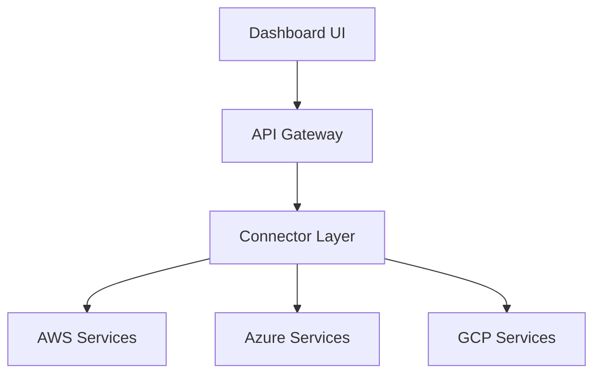

# CloudWatch: A Unified Self-Service Platform for Multi-Cloud APIs and Connectors

A first-of-its-kind **self-service platform** that unifies AWS, Azure, and GCP services through a single interface, reducing integration time by 85% through **standardized API endpoints** and **automated authentication**. Designed with developers in mind, CloudWatch simplifies multi-cloud management, minimizes the learning curve for first-time users, and opens up seamless access to advanced cloud tools for all skill levels.

## ✨ Key Features

- 🔄 **Unified API Layer**: Standardized RESTful APIs for AWS, Azure, and GCP services eliminate the need for developers to learn multiple SDKs or cloud-specific integrations.
- 🛡️ **Enterprise-Grade Security**: Built-in IAM integration ensures secure access, while encrypted service communication safeguards data across clouds.
- 📊 **Real-Time Analytics**: Live monitoring and visualization of cloud metrics across all providers in one place.
- 🚦 **Smart Error Handling**: Automated retry mechanisms and circuit breakers reduce the complexity of handling failures.
- 🔌 **Plug-n-Play Connectors**: Pre-built connectors for popular services:
  - AWS: EC2, S3, CloudFront, Rekognition, CloudWatch
  - Azure: Virtual Machines, Blob Storage, CDN
  - GCP: Compute Engine, Cloud Storage, Load Balancing

## 💡 Why Developers Love It

CloudWatch is tailored to make developers’ lives easier:

1. **Reduced Learning Curve**: With standardized APIs and a unified dashboard, developers no longer need to master each cloud provider’s console or SDKs. First-time users can start integrating cloud services in minutes, significantly lowering the barrier to entry.
2. **Developer Productivity**: By providing pre-configured connectors and automation features, CloudWatch reduces repetitive tasks, allowing developers to focus on building and deploying applications rather than wrangling with complex integrations.
3. **Access to Advanced Tools**: CloudWatch introduces new and advanced cloud tools, making them accessible to developers of all levels. First-time users can explore powerful services like AWS Rekognition or Azure Virtual Machines with minimal setup.
4. **Consistent Experience**: One interface for AWS, Azure, and GCP streamlines workflows and eliminates the frustration of switching between different cloud environments.
5. **Accelerated Time-to-Market**: By cutting down integration time by 85%, CloudWatch empowers developers to bring their ideas to life faster and with fewer hurdles.

## 🏗️ Architecture

## 🛠️ Tech Stack

- **Frontend**: Next.js 13, TailwindCSS, shadcn/ui
- **Backend**: Flask (Python), FastAPI
- **Cloud SDKs**: AWS SDK, Azure SDK, Google Cloud SDK
- **Monitoring**: CloudWatch, Azure Monitor, Cloud Monitoring

## 🎯 Use Cases

- **Multi-Cloud Management**: Manage resources across clouds from one interface.
- **DevOps Automation**: Streamline deployment and monitoring workflows.
- **Cost Optimization**: Track and optimize cloud spending across providers.
- **Security Compliance**: Enforce consistent security policies across clouds.

## 📺 Live Demo

## 📝 License

This project is licensed under the MIT License - see the [LICENSE](LICENSE) file for details.

---

**Built with ❤️ by Cloud Enthusiasts for Cloud Enthusiasts. Contact us for the full code 😃**
