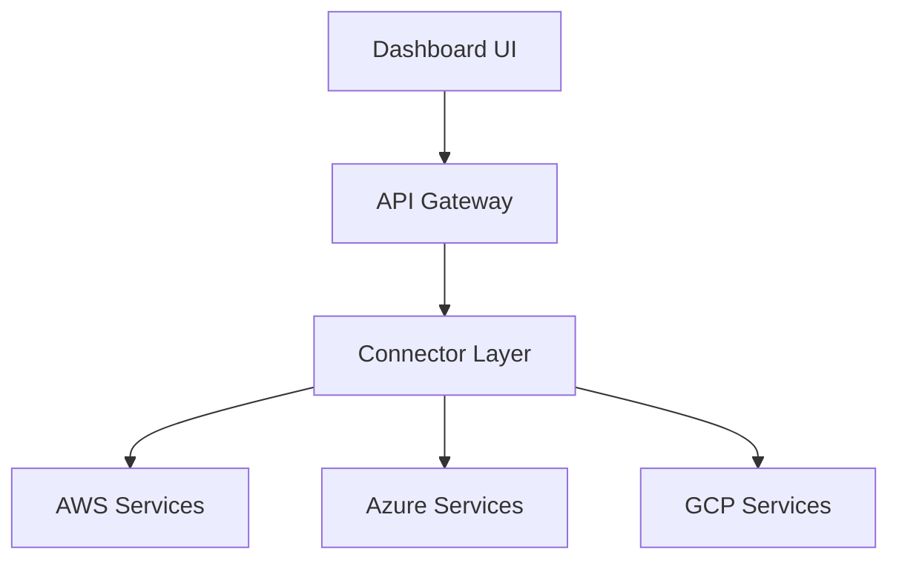

# CloudWatch-A-Unified-Self-Service-Platform-for-Multi-Cloud-APIs-and-Connectors-
First-of-a-kind self-service platform that unifies AWS, Azure, and GCP services through a single interface, reducing integration time by 85% through standardized API endpoints and automated authentication.

## ✨ Key Features
- 🔄 **Unified API Layer**: Standardized RESTful APIs for AWS, Azure and GCP services
- 🛡️ **Enterprise-Grade Security**: Built-in IAM integration, encrypted service communication
- 📊 **Real-Time Analytics**: Live monitoring and visualization of cloud metrics
- 🚦 **Smart Error Handling**: Automated retry mechanisms and circuit breakers
- 🔌 **Plug-n-Play Connectors**: Pre-built connectors for popular services:
  - AWS: EC2, S3, CloudFront, Rekognition, CloudWatch
  - Azure: Virtual Machines, Blob Storage, CDN
  - GCP: Compute Engine, Cloud Storage, Load Balancing
## 🏗️ Architecture

## 🛠️ Tech Stack
- **Frontend**: Next.js 13, TailwindCSS, shadcn/ui
- **Backend**: Flask (Python), FastAPI
- **Cloud SDKs**: AWS SDK, Azure SDK, Google Cloud SDK
- **Monitoring**: CloudWatch, Azure Monitor, Cloud Monitoring
## 🔥 Why It's Revolutionary
1. **Self-Service APIs**: Developers can integrate cloud services with minimal code
2. **Unified Experience**: One dashboard to rule them all - no more console juggling
3. **Smart Automation**: Intelligent error handling and automatic retries
4. **Enterprise Ready**: Production-grade security and monitoring built-in
5. **Extensible Architecture**: Easy to add new cloud services and connectors
## 📚 Documentation
Full documentation is available in the [/docs](./docs) directory:
- [API Reference](./docs/api-reference.md)
- [Connector Guide](./docs/connectors.md)
- [Security Overview](./docs/security.md)
- [Deployment Guide](./docs/deployment.md)
## 🎯 Use Cases
- **Multi-Cloud Management**: Manage resources across clouds from one interface
- **DevOps Automation**: Streamline deployment and monitoring workflows
- **Cost Optimization**: Track and optimize cloud spending across providers
- **Security Compliance**: Enforce consistent security policies across clouds
## 📺 Live Demo
Coming Soon! Stay tuned for our interactive demo showcasing the power of unified cloud management.
## 📝 License
This project is licensed under the MIT License - see the [LICENSE](LICENSE) file for details.
---
Built with ❤️ by Cloud Enthusiasts for Cloud Enthusiasts. Contact us for the full code 😃
